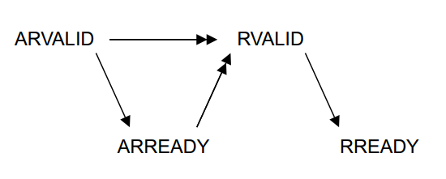
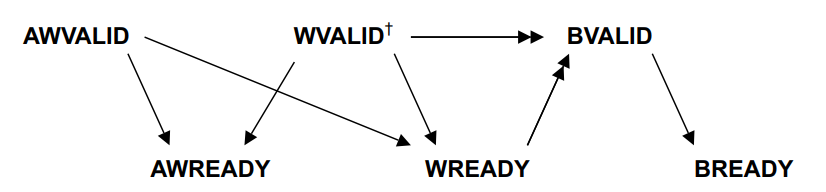

# 2. Formal AXI slave

Model checking works in such a way that memory reads must be formally randomized. Indeed, a proof of correctness for a core means that it does not violates the specification, no matter the code it executes and the data it reads.

The riscv-formal tool puts symbolic inputs for each cycle and signal. The space of inputs can then be restricted by adding hypotheses, such as SystemVerilog assumptions.

The tool provides example of cores to verify, using a wrapper which generates symbolic inputs respecting the memory protocol. For every example the tool provides, the native memory interface is always quite simple. Figure 2 gives the example for  the picorv32 memory interface.

input/output signal | size | meaning
|-- |-- |--
output | 1  | `mem_valid` | valid handshake for read / write
output | 1  | `mem_instr` | 0 for writes, 1 for reads.
input  | 1  | `mem_ready` | ready handshake for read / write
output | 32 | `mem_addr`  | read / write address
output | 32 | `mem_wdata` | data to be written
input  | 32 | `mem_rdata` | read data 
output | 4  | `mem_wstrb` | byte selection in `mem_wdata`

__Figure 2: picorv32 native memory interface__

The protocol has a single read/write channel and only two inputs. Therefore it is not hard to meet the specification in this case. The example puts random values in both `mem_rdata` and `mem_ready` at every clock cycle. 

However, some processor cores export more complex native memory interfaces. For example, in a real-case System-On-Chip with no cache, the core is often connected to an AHB, APB or AXI-lite bus arbiter. This fact motivates the need of a formal memory slave.

The picorv32 is available in 3 different versions: 

- `picorv32`, wich uses the native memory interface presented on figure 2.
- `picorv32_axi`, which uses an AXI-lite memory interface.
- `picorv32_wb`, which uses a WhishBone memory interface.

This project provides the way to verify a core with a AXI-lite memory interface. The solution was to write a memory slave which reads symbolic values and ignores writes. To take memory stalls in consideration and potentially find associated bugs, the slave responds in a random time.

## 2.1. AXI-lite protocol

AXI-lite is a light-weight adaptation of the ARM's Advanced eXtensible Interface protocol. It introduces the concept of __master__, __slave__, __channels__ and __handshakes__.
The master is the initiator of the requests. It asks the slave to read or to write and the slave acknowledges.

AXI-lite provides the following channels:

- Address Read
- Read Response
- Data Write
- Address Write
- Write Response

While the Address Read, Address Write and Data Write channels are driven by the master, the Read Response and Write Response channels are driven by the slave.
The channel driver controls a `VALID` signal while the other end controls a `READY` signal. A transaction happens in a channel whenever both `VALID` and `READY` are asserted at the same time during one cycle. It is called a handshake.

A read sequence happens when a handshake on the Read Response Channel follows a handshake on the Read Address Channel.

A write sequence happens when handshakes on the Address Write and Data Write channels are followed by a handshake on the Write Response channel. Figure 3 shows the main AXI-lite signals. 

Figure 4 and 5 show the dependency between the channels for read and write sequences. A simple arrow from A to B means that A and B must be asserted simultaneously. a double arrow from A and B to C means that if A and B are asserted simultaneously, C must eventually rise.

  
    
       

 
 
 

__Address Read Channel__

name | size (bits) | driver |  meaning 
-- |-- |-- |--
ARVALID | 1  |  master | valid signal
ARREADY | 1  |  slave  | ready signal
ARADDR  | 32 |  master | read address

__Read Response Channel__

name | size (bits) | driver |  meaning 
-- |-- |-- |--
RVALID | 1  | slave  | valid signal
RREADY | 1  | master | ready signal
RDATA  | 32 | slave  | read data
RRESP  | 2  | slave  | read response (for errors)

__Address Write Channel__

name | size (bits) | driver |  meaning 
-- |-- |-- |--
AWVALID   | 1  | master  | valid signal
AWREADY   | 1  | slave   | ready signal
AWADDR    | 32 | master  | write address

__Data Write Channel__

name | size (bits) | driver |  meaning 
-- |-- |-- |--
WVALID    | 1  | master | valid signal
WREADY    | 1  | slave  | ready signal
WDATA     | 32 | master | write data
WSTRB     | 4  | master | 

__Write Response Channel__

name | size (bits) | driver |  meaning 
-- |-- |-- |--
BVALID    | 1  | slave  | valid signal
BREADY    | 1  | master | ready signal
BRESP     | 1  | slave  | write response (for errors)

__Figure 3: AXI-lite signals__

__Figure 4: Read  transaction handshake dependencies, from the AXI Specification[6]__

 

__Figure 5: Write transaction handshake dependencies, from the AXI Specification[6]__

## 2.2. Implementation

`riscv-formal` provides a way to generate N bit symbolic registers - Registers that can potentially hold any possible value at every clock cycle. The slave is based on the use of these registers. However the AXI-lite specification requires the following main properties for a slave:

- P1 - `RDATA` and `RRESP` must be stable while `RVALID` is asserted.
- P2 - `BRESP` must be stable while `BVALID` is asserted.
- P3 - `RVALID` must eventually rise after a handshake on the address read channel.
- P4 - `RVALID` must only rise after a handshake on the address read channel.
- P5 - `BVALID` must eventually rise after a handshake of both the write and address write channels.
- P6 - `BVALID` must only rise after a handshake of both the write and address write channels.

The `ARREADY`, `RVALID`, `AWREADY`, `WREADY` and `BVALID` signals are symbolic and still 

`RRESP` and `BRESP` are not used by the `picorv32_axi` core, so they are not generated by the slave. However, a core could make use of these signals to generate memory access exceptions. For such a core, it would be useful to give it a symbolic value when `RVALID` and respectively `BVALID` are asserted.

## 2.3. Verification

The random slave has been first verified in simulation, using _Mentor Questa Simulator_ and random values. As stated in the introduction section, simulation-based verification is not enough to provide a proof of correctness, so  the slave has then been formally verified using __unbounded model checking__. The Mentor Verification tool ran SystemVerilog assertions and proved P1 - P6. Note that the verification module has been done as a part of a University lab at Telecom Paris.

## 2.4. Liveness conditions

As an example of use, the `picorv32_axi` core is verified using presented formal axi-lite slave. See the git repository for instruction to reproduce the verification.

Note that this method won't provide a proof of correctness for the AXI-lite port. A formal checker can be used conjointly to prove it.

The `riscv-formal` liveness check requires stronger assumptions on the memory interface. Indeed, the slave can take an arbitrary time to response. The verification wrapper is modified so that memory transactions take at most 9 clock cycles. The liveness check is passed using this value, for a symbolic execution of 30 clock cycles.

