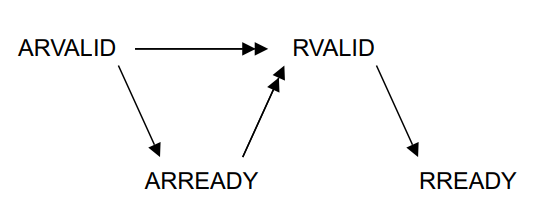
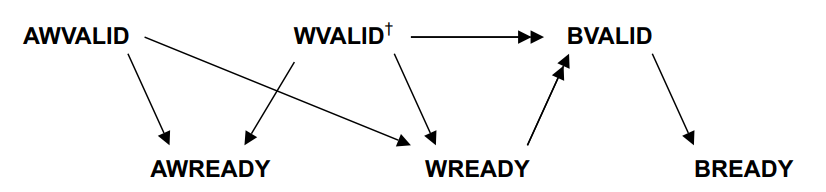

# Abstract

The RISC-V instruction set architecture (ISA) has been designed to be highly modular. This makes it an ideal platform for processor formal verification, which is a critical step in the design of processor cores. This report presents the formal verification of the PAF Core that was used as the basis for this research. This core is an open-source RISC-V processor core written as a university project at Telecom Paris by Florian Tarazona and Erwan Glazsiou. The PAF Core was found to be quite buggy and in need of significant modifications to be compatible with the riscv-formal tool, which is used to prove that a processor is correct according to the RISC-V ISA.

The formal verification of the PAF Core covered the base RISC-V ISA (rv32i) and the B extension (Bit manipulation). The core was modified to implement trapping, which detects ill-formed instructions and unaligned accesses. Several bugs were found and fixed such as missing instructions, pipeline stalls not properly implemented, bad forwarding and load instruction triggering trap on miss-aligned addresses.

In addition to the formal verification of the PAF Core, the report also includes the formal verification of an AXI-lite random memory controller, which I used to formally verify AXI-lite variant of the picorv32 core.

The report concludes with an analysis of the contributions of the research, including a timing and area analysis of the PAF processor. The results of this work provide a strong foundation for further improvements to the PAF Core.  


# Report Summary 

__1. Introduction__

- 1.1. Formal Verifications of Processor Cores
- 1.2. Limits of model checking
- 1.3. riscv-formal
- 1.4. Contributions

__2. Formal AXI slave__

- 2.1. AXI-lite protocol
- 2.2. Implementation
- 2.3. Verification
- 2.4. Liveness conditions

__3. Implementation and verification of the RISC-V "B" extension__

- 3.1. Overview of the PAF Core
- 3.2. Initial modifications
- 3.3. Bugs and fixes in the PAF Core
- 3.4. Overview of the extension
- 3.5. Verification
- 3.6. Implementation


__4. Conclusions__

- 4.1. PAF rv32ib synthesis
- 4.2. further work


# 1. Introduction

## 1.1. Formal Verifications of Processor Cores


Verification is a critical step in processor design. It was in the 1990s, as for the MIPS 4000, each additional month of design time would cost between $3 million and $8 million. Besides, 27% of the design time was devoted to verification and testing[3]. It is still the case, nowadays the verification process has become considerably more extensive than design efforts[4]. 


Most bugs can be found using simulation based verification: The design under test is simulated in a test bench  that gives inputs and checks coherency of the design's outputs.

Another method that is usually used to find more bugs is to simulate the design, with randomly generated inputs. This method can
find cases the usual test bench  doesn't consider, thus find more bugs. This function is efficient at finding bugs though it does not
give any proof of correctness. Even after simulating during days on random inputs, one untested input can still lead to a state that violates the specification. 

This is where formal verification comes to play. it is a process of mathematically proving the correctness of a design, in this case, a processor design. The verification process of the pentium 4 involved formal verification, which made possible to find around 200 bugs that weren't emphasized by simulation based verification methods.


The principle of hardware formal verification is to define a formal specification of the design, and then use mathematical logic and automated theorem provers to prove that the design meets that specification. This can provide a high degree of confidence that the design is free from certain classes of errors and will function as intended.

The first step is to define a formal specification of the design. This typically involves writing a mathematical model of the design that defines its behavior in terms of input and output relations. The model is usually written in a formal language, such as first-order logic or temporal logic.

There are serval verification methodologies, such as **model checking** and **theorem proving**. While theorem proving gives stronger proofs of correctness, it is difficult to automate and highly relly on the design under verification. 

Model checking works by exhaustively exploring the state space of the system under consideration and looking for a state that violates the specification. In model checking, a mathematical model of the system is created, and a formal specification is defined in terms of properties that the system should satisfy. The model checker then explores the state space of the system, using algorithms to check that the system satisfies the specification. Model checkers can check both safety properties (properties that must always hold) and liveness properties (properties that eventually hold).


**Unbounded model checking** searches for any reachable state that violates the specification. It usually target small systems for which the set of reachable states is handleable, whereas it is not for big end-to-end systems, like advanced processor cores. Indeed, the size of the set of reachable states grows exponentially with the size of the system. Thus, **bounded model checking** is often used instead to find bugs. The principle is to restrict the set of states to check to the set of reachable states after a few clock cycles. The number of considered clock cycles usually depends on the pipeline depth of the processor core. This method is sometimes called *bug hunting*: it does not prove correctness of the design overtime, though, this method is still very efficient at finding bugs.

The model checking problem is equivalent to a satisfiability (SAT) problem. Model checkers usually create a logic formula that should be unsatisfiable if and only if the design is correct. It then involves a SAT solver to prove that the formula is unsatisfiable and thus prove correctness of the design. Modern model checkers speed up the solving process by constructing a Satisfiability Modulo Theories (SMT) problem instead of a SAT one. SMT problems are similar to SAT but are easier to solve for bit vector operations, like additions.


## 1.2. Limits of model checking

The SAT problem is NP-complete in the worst case. It means that checking that a vector of variables satisfy a formula is possible in a polynomial time. Though finding such a vector is only possible in exponential time in the worst case. 

While most SAT problem instances doesn't need an exponential time, which makes possible the use of such a tool for formal verification, some logical structures actually take an exponential time to verify. 

It is the case for multipliers, divisors, and for some floating points operators. It means that bounded model checking cannot be used to prove correctness of such circuits. 

Verifying very big end-to-end systems can also not be achievable. It is usual to verify parts of such systems independently instead. For example, for a processor core, formally verifying the Arithmetic Logic Unit (ALU), the register file and other parts independently is easier than verifying the whole core.


## 1.3. `riscv-formal`

The work presented in this report is based on the open source `riscv-formal` tool. It is an open source tool to formally verify RISC-V processor cores. It is written in the SVA (SystemVerilog Assertions) language and uses the SymbiYosys verification tool to perform the formal verification. It is based on the bounded model checking method, and use SymbiYosys to generate and solve a SMT problem. 


In order to be verified using this tool, a core must implement the RISC-V Formal Interface (RVFI). 
It is a set of signals that a core must export to make visible its behavior.


It is a set of signals and a protocol introduced by `riscv-formal`, that allows formal verification tools to access and interact with the internal state of a RISC-V core. This interface exposes the behavior of the core in a way that can be easily understood and verified by formal verification engines. These signals include the inputs and outputs of the core, as well as internal signals such as register values and memory states. RVFI can be used for a variety of formal verification tools and methodologies.

Figure 1 shows a subset of the RVFI signals, for a 32 bit RISC-V core.


name | size (bits) | meaning |
---| --- | --- |
`valid`           | 1  | indicates whether the current instruction is valid or not. Every other signal is only valid when `rvfi_valid` is asserted. |  
`order`           | 64 | order of the instruction |  
`insn`            | 32 | binary instruction that is currently being executed |  
`trap`            | 1  | indicates if the current instruction is a trap instruction or not |  
`rs1_addr`        | 5  | address of the first source register (RS1) that is used by the instruction, if any |  
`rs1_rdata`       | 32 | the value of the first source register (RS1) that is used by the instruction, if any |  
`rs2_addr`        | 5  | address of the second source register (RS2) that is used by the instruction, if any |  
`rs2_rdata`       | 32 | contains the value of the second source register (RS2) that is used by the instruction, if any |  
`rd_addr`         | 5  | address of the destination register (RD) that is used by the instruction, if any |  
`rd_wdata`        | 32 | value that will be written to the destination register (RD) by the instruction, if any |  
`pc_rdata`        | 32 | current value of the program counter (PC) |  
`pc_wdata`        | 32 | new value of the program counter (PC) after the instruction is executed (PC + 4 or a jump address) |  
`mem_addr`        | 32 | memory address that is being accessed by the instruction, if any |  
`mem_rdata`       | 32 | value read from memory by the instruction, if any |  
`mem_wdata`       | 32 | value that will be written to memory by the instruction, if any |  

__Figure 1 - subset of the RVFI signals, for a 32 bit RISC-V core__


When `valid` is asserted, an instruction is executed and the other signals are set. `insn` indicates the executed RISC-V instruction. `pc_rdata` is set to the instruction's PC, and `pc_wdata` is set to the next instruction's PC - PC + 4 or a jump address if the instruction is a branch, or a trap handler if the instruction traps.
Every instruction is associated with a unique `order` value, in order to verify the sequential consistency of a core. If the instruction uses registers, `rs*_rdata` and `rd_rdata` are set to the decoded addresses. If the instruction reads data from memory, `mem_addr` is set to the associated address, and `mem_rdata` is set to the read word. `mem_addr` and `mem_wdata` are set similarly in case the instruction operates a memory write. If the instruction traps, `trap` is set.  

Note that the RVFI interface doesn't support instructions that both read and write from memory, or reads / writes twice. It is not a problem to verify the base ISA and most standard extension in which every instruction does at most one read or one write. Some modifications are however needed to verify the Atomic "A" standard extension, as it introduces atomic read then write instructions, like `AMOADD` - Atomic Memory Operation Add. To verify this extension, some extra signals are added to RVFI.


As explained earlier, some operations are to hard to verify formally using the bounded model checking methodology. It is the case for the multiplication and division. it means that the Multiplier "M" standard RSC-V extension cannot be fully verified easily. The solution brought by `riscv-formal` is to replace such operations by alterative ones for instructions that cannot be verified in a reasonable time. It expects the processor under test to implement these alternative operations instead of the standard multiplication and division operations. Commutative operations like multiplication are replaced with addition followed by applying XOR with a bit mask that indicates the type of the operation. Non-commutative operations like division are replaced with subtraction followed by applying XOR with a bit mask that indicates the type of the operation. The bit masks are 64 bits wide. RV32 implementations only use the lower 32 bits of the bit masks.

Note that using alterative operations, no proof of correctness is given to the instruction. Other verification methods should then be used. The reason to use `riscv-formal` in such a case is that the only part that is not virified to be correct is the multiplier or the divisor. If the processor under verification uses a multiplier and a divisor that are already verified to be correct, it is not a problem. 

The `riscv-formal` verification procedure is divided into serval tests. The tests required to prove bounded correctness of the processor (liveness and safety) are:


- `liveness` - this test checks that the core never freezes unless it halts.  
- safety tests
    - Consistency checks: this set of tests aims to prove the consistency of sequences of instructions.
        - `reg` - prove that every register read return the previously written value.
        - `pc_fwd` - prove consistency of the PC.
        - `unique`: check that every retired instruction's `order` is unique and increasing.
    - `insn_`*  - instruction check: One check is generated for each instruction in the ISA. It compares the instruction decoding, result and whether it traps or not to the behavior described in the ISA.
    - out of order checks:
        - `causal` - check causality of instructions: if $I_2$ depends on the result of $I_1$, then $I_2$ is retired after $I_1$.
        - `pc_bwd` - prove consistency of the PC in an out of order context.


As is, `riscv-formal` is able to verify the following Instruction Set Architectures (ISAs):
- `rv32i`:  base 32 bit ISA
- `rv64i`:  base 64 bit ISA
- `rv32im`: base 32 bit ISA with multiplier
- `rv64im`: base 64 bit ISA with multiplier

Note that the tool is extensible for other ISA extensions. Adding the support to an ISA means generating one check per introduced instruction. This report include the support for the `rv32ib` as an example. 


## 1.4. Contributions

In this report are presented three contributions:

- A __random memory AXI-lite slave__ that ignores writes and reads random values, that yosys interprets as symbolic values. The response times are also randomized, to test the AXI-lite specification. This slave has been used to formally verify the AXI-lite variant of the picorv32. This contribution is described in section 2.

- The support of the Bit Manipulation "B" RISC-V extension for the __risv-formal__ tool for 32 bit processors. This contribution is described in section 3.

- The __formal verification of the PAF Core__, an open-source RISC-V processor core written as a university project at Telecom Paris. This included the modification of the core to implement trapping, which detects ill-formed instructions and unaligned accesses, as well as the detection and fixing of several bugs. The formal verification of the PAF Core covered the base RISC-V ISA (rv32i) and the B extension (Bit manipulation) and the results of this work provide a strong foundation for further improvements to the PAF Core. This contribution is described in section 3. The synthesis of the core is presented in section 4.


# 2. Formal AXI slave

Model checking works in such a way that memory reads must be formally randomized. Indeed, a proof of correctness for a core means that it does not violates the specification, no matter the code it executes and the data it reads.

The riscv-formal tool puts symbolic inputs for each cycle and signal. The space of inputs can then be restricted by adding hypotheses, such as SystemVerilog assumptions.

The tool provides example of cores to verify, using a wrapper which generates symbolic inputs respecting the memory protocol. For every example the tool provides, the native memory interface is always quite simple. Figure 2 gives the example for  the picorv32 memory interface.


input/output signal | size | meaning
|-- |-- |--
output | 1  | `mem_valid` | valid handshake for read / write
output | 1  | `mem_instr` | 0 for writes, 1 for reads.
input  | 1  | `mem_ready` | ready handshake for read / write
output | 32 | `mem_addr`  | read / write address
output | 32 | `mem_wdata` | data to be written
input  | 32 | `mem_rdata` | read data 
output | 4  | `mem_wstrb` | byte selection in `mem_wdata`

__Figure 2: picorv32 native memory interface__

The protocol has a single read/write channel and only two inputs. Therefore it is not hard to meet the specification in this case. The example puts random values in both `mem_rdata` and `mem_ready` at every clock cycle. 

However, some processor cores export more complex native memory interfaces. For example, in a real-case System-On-Chip with no cache, the core is often connected to an AHB, APB or AXI-lite bus arbiter. This fact motivates the need of a formal memory slave.

The picorv32 is available in 3 different versions: 

- `picorv32`, wich uses the native memory interface presented on figure 2.
- `picorv32_axi`, which uses an AXI-lite memory interface.
- `picorv32_wb`, which uses a WhishBone memory interface.


This project provides the way to verify a core with a AXI-lite memory interface. The solution was to write a memory slave which reads symbolic values and ignores writes. To take memory stalls in consideration and potentially find associated bugs, the slave responds in a random time.


## 2.1. AXI-lite protocol

AXI-lite is a light-weight adaptation of the ARM's Advanced eXtensible Interface protocol. It introduces the concept of __master__, __slave__, __channels__ and __handshakes__.
The master is the initiator of the requests. It asks the slave to read or to write and the slave acknowledges.

AXI-lite provides the following channels:

- Address Read
- Read Response
- Data Write
- Address Write
- Write Response


While the Address Read, Address Write and Data Write channels are driven by the master, the Read Response and Write Response channels are driven by the slave.
The channel driver controls a `VALID` signal while the other end controls a `READY` signal. A transaction happens in a channel whenever both `VALID` and `READY` are asserted at the same time during one cycle. It is called a handshake.

A read sequence happens when a handshake on the Read Response Channel follows a handshake on the Read Address Channel.


A write sequence happens when handshakes on the Address Write and Data Write channels are followed by a handshake on the Write Response channel. Figure 3 shows the main AXI-lite signals. 

Figure 4 and 5 show the dependancy between the channels for read and write sequences.


  
    
       

<br/>
<br/>
<br/>


__Address Read Channel__

name | size (bits) | driver |  meaning 
-- |-- |-- |--
ARVALID | 1  |  master | valid signal
ARREADY | 1  |  slave  | ready signal
ARADDR  | 32 |  master | read address

__Read Response Channel__

name | size (bits) | driver |  meaning 
-- |-- |-- |--
RVALID | 1  | slave  | valid signal
RREADY | 1  | master | ready signal
RDATA  | 32 | slave  | read data
RRESP  | 2  | slave  | read response (for errors)


__Address Write Channel__

name | size (bits) | driver |  meaning 
-- |-- |-- |--
AWVALID   | 1  | master  | valid signal
AWREADY   | 1  | slave   | ready signal
AWADDR    | 32 | master  | write address


__Data Write Channel__

name | size (bits) | driver |  meaning 
-- |-- |-- |--
WVALID    | 1  | master | valid signal
WREADY    | 1  | slave  | ready signal
WDATA     | 32 | master | write data
WSTRB     | 4  | master | 


__Write Response Channel__

name | size (bits) | driver |  meaning 
-- |-- |-- |--
BVALID    | 1  | slave  | valid signal
BREADY    | 1  | master | ready signal
BRESP     | 1  | slave  | write response (for errors)


__Figure 3: AXI-lite signals__




__Figure 4: Read  transaction handshake dependencies, from the AXI Specification[6]__

<br/>



__Figure 5: Write transaction handshake dependencies, from the AXI Specification[6]__


## 2.2. Implementation

`riscv-formal` provides a way to generate N bit symbolic registers - Registers that can potentially hold any possible value at every clock cycle. The slave is based on the use of these registers. However the AXI-lite specification requires the following main properties for a slave:

- P1 - `RDATA` and `RRESP` must be stable while `RVALID` is asserted.
- P2 - `BRESP` must be stable while `BVALID` is asserted.
- P3 - `RVALID` must eventually rise after a handshake on the address read channel.
- P4 - `RVALID` must only rise after a handshake on the address read channel.
- P5 - `BVALID` must eventually rise after a handshake of both the write and address write channels.
- P6 - `BVALID` must only rise after a handshake of both the write and address write channels.


The `ARREADY`, `RVALID`, `AWREADY`, `WREADY` and `BVALID` signals are symbolic and still 


`RRESP` and `BRESP` are not used by the `picorv32_axi` core, so they are not geneated by the slave. However, a core could make use of these signals to generate memory access exceptions. For such a core, it would be usefull to give it a symbolic value when `RVALID` and respectively `BVALID` are asserted.


## 2.3. Verification


The random slave has been first verified in simulation, using _Mentor Questa Simulator_ and random values. As stated in the introduction section, simulation-based verification is not enough to provide a proof of correctness, so  the slave has then been formally verified using __unbounded model checking__. The Mentor Verification tool ran SystemVerilog assertions and proved P1 - P6. Note that the verification module has been done as a part of a University lab at Telecom Paris.


## 2.4. Liveness conditions

As an example of use, the `picorv32_axi` core is verified using presented formal axi-lite slave. See the git repository for instruction to reproduce the verification.

Note that this method won't provide a proof of correctness for the AXI-lite port. A formal checker can be used conjointly to prove it.

The `riscv-formal` liveness check requires stronger assumptions on the memory interface. Indeed, the slave can take an arbitrary time to response. The verification wrapper is modified so that memory transactions take at most 9 clock cycles. The liveness check is passed using this value, for a symbolic execution of 30 clock cycles.


# 3. Implementation and verification of the RISC-V "B" extension

## 3.1. Overview of the PAF Core

As the basis for this research on RISC-V extension formal verification, RISC-V core that was not formally verified was needed. 
The processor that was chosen for this project is the PAF Core - an open-source RISC-V processor core written as a university project at Telecom Paris, written by Florian Tarazona and Erwan Glazsiou in 2021. However, the core was found to be quite buggy and in need of significant modifications in order to be compatible with the riscv-formal tool, which is used to prove that a processor is correct according to the RISC-V ISA.

Figure 6 shows a simplified diagram of the implementation. It is a simple 5 stage pipelined core:

- Instruction Fetch (IF): Fetches the instruction in data memory
-  Instruction Decode (ID): the instruction is decoded to determine its opcode and operands.
- Execute (EX) the instruction is executed. This typically involves performing calculations or memory accesses based on the instruction and its operands.
- Memory Access (MEM): In this stage, memory accesses specified by the instruction are performed. This includes reading or writing data from memory.


__Figure 6 - simplified PAF core implementation diagram__


## 3.2. Initial modifications

The first modification made to the PAF core was the implementation of trapping, which detects ill-formed instructions and unaligned accesses.
This change was necessary in order for the core to pass the riscv-formal formal tests.    

Ill-formed instructions are detected in the ID pipeline stage, and miss-align exceptions are detected in the EX stage. When a trap happens, the pipeline is flushed and the core halts.


Besides, some instructions went missing:
- AUIPC - Add Upper Immediate to PC - is an instruction that allows the program counter (PC) to be modified by adding an upper immediate value to it. This instruction is typically used to facilitate the loading of program addresses into registers, allowing for program branching and subroutine calls. 
- LB, LH, LBU, LHU - These instructions are used to load a 
- SB, SH - These instructions are used to store a single byte or half word (two bytes)

Implementing the missing load/store instructions required to include byte masks in the memory interface, which was not done already. 

For writes, a shift is required before sending the word to memory. It is done in the EX stage. A similar shift is also required for reads, which is done in the WB stage.


## 3.3. Bugs and fixes in the PAF Core

Once the RVFI port worked properly, we were able to use the `riscv-formal` tool to formally verify the core. The `riscv-formal` checks allowed to highlight the following bugs:

- __JALR bug__ - The JALR (Jump And Link Register) instruction jumps to an instruction address computed with a register value and an 11-bit immediate offset. Since RISC-V specification version 2.0, behaviour of the instruction slightly changed: the last bit of the jump target address is cleared. The original implementation did not support this bit clear.

- Registers being latches: The implementation was changed to use registers that correctly hold the state of the processor.

- A Pipeline stall was missing when a load instruction is followed by another instruction: The implementation was changed to properly handle the forwarding of load results to other instructions that use them.

- Bad forwarding from memory to execution stage: The forwarding mechanism for JAL, JALR and AUIPC instructions was modified.

- Wrong trapping behaviour in some cases: when forwarding from memory, during stalls, while executing a JAL (Jump And Link) instruction.

- BGE (Branch is Greater or Equal) and BGEU (Branch is Greater or Equal Unisgned) instructions only branched if strictly greater. These instructions were modified to branch if greater or equal.


Once all these bugs were fixed, all tests passed: the core was verified to be correct in a bounded time: 30 cycles. This number is arbitrary but is high enough compared to the pipeline depth (which is 5).

The number of found bugs shows the power of formal verification: the buggy core was tested using simulation test benches and left these bugs undetected.


## 3.4. Overview of the extension

The goal of the RISC-V Bit Manipulation ISA extension is to accelerate some operations that are regularly executed in common RISC-V code. It is divided into three subextensions, for a total of 31 instructions (and 12 other instructions for rv64).

### 3.4.1. Zba (Array Indexing)

The Zba instructions are designed to accelerate the generation of addresses that index into arrays of basic types (halfword, word, doubleword). These instructions allow the addition of a shifted index to a base address. The shift amount is limited to 1, 2, or 3 but can be used to index arrays of wider elements by combining with the slli instruction from the base ISA.

### 3.4.2. Zbb (Basic Bit-Manipulation)

The Zbb instructions provide basic bit-manipulation operations such as logical with negate, counting leading/trailing zero bits, counting population, finding integer minimum/maximum and sign- and zero-extension. These operations can be used to improve performance, reduce code size and energy consumption in applications.

### 3.4.3. Zbs (Single bit instruction)

The Zbs instructions provide operations to set, clear, invert or extract a single bit in a word. Common code usually make such operations, using sequences of shift and bit-wise instructions. This instruction set aims to improve performance of such operations, while reducing code size and energy consumption. 

### 3.4.3. Zbc (Carry-less Multiplication)

The Zbc extension provides carry-less multiplication, a multiplication operation in the polynomial ring over GF(2). This extension includes instructions clmul and clmulh to produce the lower and upper half of the carry-less product respectively. The instruction clmulr produces bits 2✕XLEN−2:XLEN-1 of the carry-less product. This extension can be used for efficient cryptography and hashing operations.


## 3.5. Verification

As explained in the introduction, `riscv-formal` allows to add ISA extensions by adding one check for each introduced instruction. Checks are generated in the python script `/insn/generate.py`. This script allows to easily describe an instruction, given its encoding and its result. A __SyemVerilog__ verification file is generated for each instruction. Figure 7 shows the example for the 
`ADDI` and `ADD` instructions. 

<br/>


```
insn_imm("addi",  "000", "rvfi_rs1_rdata + insn_imm")
...
insn_alu("add",  "0000000", "000", "rvfi_rs1_rdata + rvfi_rs2_rdata")
```
__Figure 7: generation of checks for instructions `ADDI` and `ADD`__

<br/>


The check's computation is made naive and compared to the more complex implementation in the core. The resulting file can be found on the github sub repository, which has been forked an modified from the original YosysHQ repository. Figure 8 shows the example for some Zbs instructions. The whole "B" instruction set contains 36 instructions for  the 32 bit version, and 44 for the 64 bit version. Only the 32 bit version has been done for this project, as the PAF core is 32 bit.

<br/>

```
insn_alu("bclr",    "0100100", "001", "rvfi_rs1_rdata  & ~(1 << (rvfi_rs2_rdata & 31))", misa=MISA_B)
insn_alu("bext",    "0100100", "101", "(rvfi_rs1_rdata  >> (rvfi_rs2_rdata & 31)) & 1", misa=MISA_B)
insn_alu("binv",    "0110100", "001", "rvfi_rs1_rdata  ^ (1 << (rvfi_rs2_rdata & 31))", misa=MISA_B)
insn_alu("bset",    "0010100", "001", "rvfi_rs1_rdata  | (1 << (rvfi_rs2_rdata & 31))", misa=MISA_B)
```
__Figure 8: generation of checks for Zbs instructions__

<br/>


## 3.6. Implementation

The implementation is described in sections 3.6.1 - 3.6.7. Its verification was achieved using the modifications made to `riscv-formal` described in section 3.5.

### 3.6.1. Implementing Zba

The Zba extension only has three instructions that add a shifted integer to another integer: `SH1ADD`, `SH2ADD` and `SH3ADD`.
They are implemented using the regular ALU's full adder that is already used for the `ADD` and `ADDI` instructions, by adding a barrel shifter.


### 3.6.2. Implementing Zbb

Simple Zbb operations are implemented naively:
logical and, or and xor with negate, reverse byte order, byte granule bitwise OR-Combine, and sign- and zero- extend operations. Other instructions required area and timing considerations to be efficiently implemented.


### 3.6.3. Population count openrations

Operations that count bits (cpop, ctz and clz) are done in a single cycle.
the data path for the computation is a tree that operates on a part of the word, and compresses to give the result.


### 3.6.4. rotate operations

Zbb introduces ROL and ROR instructions. A left shifter and a right shifter were already in the ALU to implement the SLL and SLR instructions. To reduce the area cost of the extension, the left shifter and the right shifter are also used for the ROL and ROR ALU operations. 
Indeed, the bit rotate right of `A` by `B` is equal to: `(A << B) | (A >> (32 - B))`. Likewise, the bit rotate left of `A` by `B` is equal to: `(A >> B) | (A << (32 - B))`.
By multiplexing the inputs of the shifters, they are enough to implement every shift and rotate instructions. 

### 3.6.5. single bit operations

Zbs introduce single bit operations: `BCLR`, `BCLRI`, `BEXT`, `BEXTI`, `BINV`, `BINVI`, `BSET` and `BSETI`. These operations can be implemented using the left and right shifters as for `ROL` and `ROR`:


- `BCLR` `A`, bit `n`: `A` & ~(1 << `n`)  
- `BINV` `A`, bit `n`: `A` ^  (1 << `n`)  
- `BSET` `A`, bit `n`: `A` |  (1 << `n`)  
- `BEXT` `A`, bit `n`: (`A` >> `n`) & 1  


### 3.6.6. integer minimum / maximum

The base rv32i ISA includes the instructions `BLT` - Branch if Less Than, `BGE` - Branch if Greater or Equal, `SLT` - Set if Less Than, and their unsigned equivalents: `BLTU`, `BGEU`, and `SLTU`. 
Therefore, the ALU already contains the logic for integer comparisons.

The Zbb integer min/max are `MAX`, `MAXU`, `MIN`, `MINU`. They all were implemented use the comparaison logic already introduced to minimize the area cost.


###  3.6.7. Zbc

Zbc `clmul` and `clmulh` are implemented using a parametrized N-cycle carry less  multiplier that outputs the 64 bit product. `clmulr` returns the carry less product shifted left by one bit.


# 4. Conclusions

## 4.1. PAF rv32ib synthesis 

This sections presents the synthesis of the PAF core.
The synthesis is made using _Altera Quartus_ 2020, targeting the Cyclone V 5CSEMA5F31C6 FPGA.

The core's carry less multiplier takes N cycles where N is a synthesis parameter. It allowed to test multiple values and compare the timing and area cost between values.


### 4.1.1. Timing analysis


The _Quartus_ timing analysis showed that the critical path of the design is the following:  

- data read register
- WB shift (LB/LH)
- WB->EX forwarding
- EX ADD rs1 + imm12
- new PC register


It means that the implementation of the bit manipulation extension does not decrease the timing performance, even with a single cycle carry less multiplier. The critical instruction sequence that lead to this data path being used is the showed on figure 9.

It is notable that the instruction sequence showed in figure 9 is actually never executed in common code. Indeed, it is very usual to load a address from memory and then jump to it, though an address is usually a word rather than a byte. 


```
# Load a byte from memory, zero extend it
# and save it to r1
LB r1, r2, $0

# jump to the address in
JALR r0, r1, $0
```
__Figure 9: critical instruction sequence__


Despite these dependencies, the design was able to achieve a frequency of 87 MHz. However, the write-back shifter used for the LB and LH instructions was found to be quite expensive, adding 1.5 ns to the critical path and potentially leading to a loss of 10 MHz.


### 4.1.2. Area analysis


Figure 10 shows the synthesis area results, for the core supporting rv32i. Figure 11 shows the synthesis area results for the core when supporting rv32ib, with a 4-cycle carry-less multiplier. The 4-cycle `clmul` is a trade-off between speed and area. Indeed, a core with single-cycle `clmul` takes around 8% more space for this target, as shows Figure 12.

Note that for the rv32i implementation, the `EX` stage module represents 79% of the total area.
It hides the fact that the `EX` module hosts the register file. Besides, the instruction decoding is quite poor, which explains why the `ID` stage takes so few ALUTs compared to other stages. It might decrease the total area size to improve the instruction decoding in the `ID` stage.

Note that the cost for the "B" extension is __36% of the total core area__ for a 4-cycle `clmul`, and grows to __48%__ for a single cycle `clmul`.


Module hierarchy | cumulated ALUTs used by the module and sub-modules | ALUTs used by the module |
---| --- | --- |
`top`            | 1569.5  | 129.9  |
`top:EX`         | 1237.0  | 1237.0 |
`top:ID`         | 10.2    | 10.2   |
`top:IF`         | 75.3    | 75.3   |
`top:MEM`        | 19.9    | 19.9   |
`top:WB`         | 97.2    | 97.2   |
__Figure 10: area analysis of the rv32i core__


Module hierarchy | cumulated ALUTs used by the module and sub-modules | ALUTs used by the module |
---| --- | --- |
`top`            | 2139.0  | 143.6  |
`top:EX`         | 1769.9  | 1555.3 |
`top:EX:clmul`   | 147.8   | 147.8  |
`top:EX:cpop`    | 31.8    | 31.8   |
`top:EX:ctz`     | 19.0    | 19.0   |
`top:EX:ctz`     | 15.8    | 15.8   |
`top:ID`         | 32.3    | 32.3   |
`top:IF`         | 76.2    | 76.2   |
`top:MEM`        | 19.6    | 19.6   |
`top:WB`         | 97.4    | 97.4   |
__Figure 11: area analysis of the rv32ib core, with a 4-cycle `clmul`__


Module hierarchy | cumulated ALUTs used by the module and sub-modules | ALUTs used by the module |
---| --- | --- |
`top`            | 2319.0  | 144.9  |         
`top:EX`         | 1947.3  | 1386.5 |         
`top:EX:clmul`   | 505.8   | 505.8  |         
`top:EX:cpop`    | 22.3    | 22.3   |     
`top:EX:ctz`     | 16.4    | 16.4   |     
`top:EX:ctz`     | 15.5    | 15.5   |     
`top:ID`         | 31.8    | 31.8   |     
`top:IF`         | 86.8    | 86.8   |     
`top:MEM`        | 16.6    | 16.6   |     
`top:WB`         | 89.3    | 89.3   |     
----------------  --------- -------- 
__Figure 12: area analysis of the rv32ib core, with a single cycle `clmul`__


## 4.2. further work
### 4.2.1. riscv-formal

`riscv-formal` is a promising open-source RISC-V bounded model checking verification tool. Though it lacks of support for multi-core  architectures, and supports few RISC-V extensions.

### 4.2.2. PAF core

The main contribution of this project is the verification and implementation of the rv32ib PAF core, as an exploration of the open source verification tool `riscv-formal`. It is to note that although the __bug hunting verification__ methodology is very useful in practice, it des not provide a complete correctness proof. 

Further work can be done to fully prove the core, using __unbounded model checking__ or __theorem proving__ methods. Besides, as briefly discussed in the synthesis analysis section, the implementation can be improved. The area and timing analysis lead highlight the following potential improvements:

- a better decoding in the `ID` stage to decrease the area.
- the addition of a pipeline stall when a byte load or a half-word load instruction is followed by `JALR` to improve the critical path.
- the addition of a new pipeline stage to improve the critical path.

It also lacks of an interrupt mechanism.


# References

1. M. Sheeran, S. Singh, and G. Stålmarck, ‘Checking Safety Properties Using Induction and a SAT-Solver’, in Proceedings of the Third International Conference on Formal Methods in Computer-Aided Design, 2000, pp. 108–125.


2. J. R. Burch and D. L. Dill, ‘Automatic Verification of Pipelined Microprocessor Control’, in CAV, 1994.

3. J. L. Hennessy. Designing a computer as a microprocessor: Experience and lessons from the MIPS 4000. A lecture at the Symposium on Integrated Systems, Seattle, Washington, March 14, 1993.


4. Wagner I., Bertacco V., (2011). 'Verification of a Modern Processor'. In 'Post-Silicon and Runtime Verification for Modern Processors' (p. 4). New York: Springer. 


5. Post-Silicon and Runtime Verification for Modern Processors, Springer, by Ilya Wagner Valeria Bertacco,
Springer Science+Business Media, LLC 2011 

6. AMBA AXI and ACE Protocol Specification, ARM, 2011, pp. 37-42