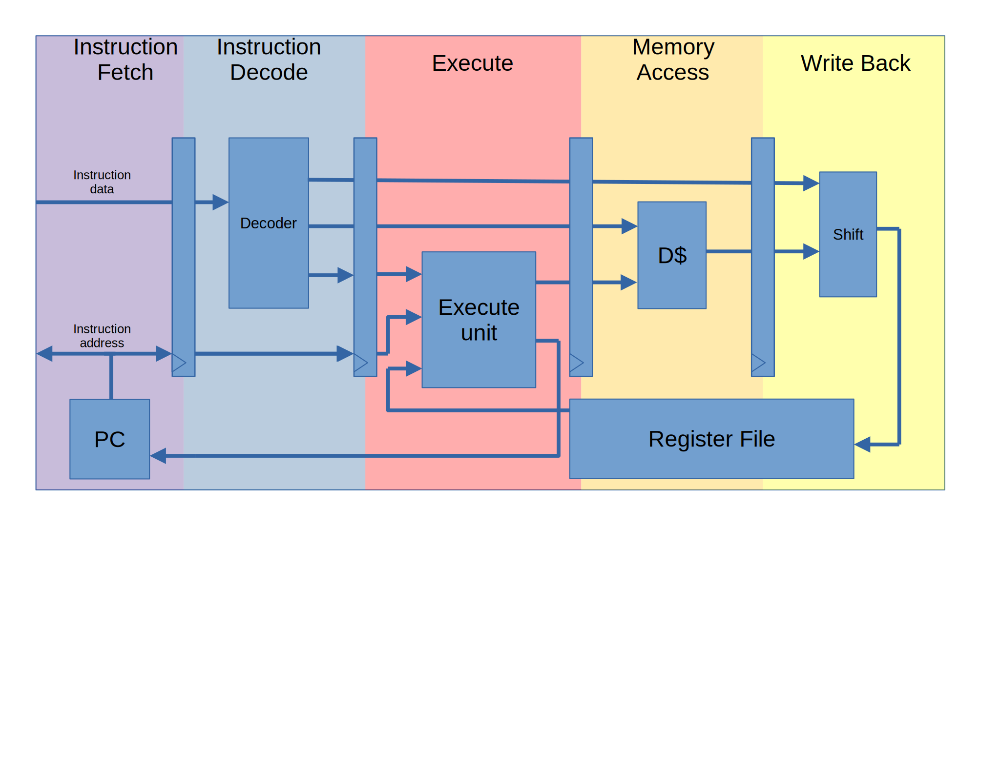

# 3. Implementation and verification of the RISC-V "B" extension

## 3.1. Overview of the PAF Core

As the basis for this research on RISC-V extension formal verification, RISC-V core that was not formally verified was needed. 
The processor that was chosen for this project is the PAF Core - an open-source RISC-V processor core written as a university project at Telecom Paris, written by Florian Tarazona and Erwan Glazsiou in 2021. However, the core was found to be quite buggy and in need of significant modifications in order to be compatible with the riscv-formal tool, which is used to prove that a processor is correct according to the RISC-V ISA.

Figure 6 shows a simplified diagram of the implementation. It is a simple 5 stage pipelined core:

- Instruction Fetch (IF): Fetches the instruction in data memory
-  Instruction Decode (ID): the instruction is decoded to determine its opcode and operands.
- Execute (EX) the instruction is executed. This typically involves performing calculations or memory accesses based on the instruction and its operands.
- Memory Access (MEM): In this stage, memory accesses specified by the instruction are performed. This includes reading or writing data from memory.

__Figure 6 - simplified PAF core implementation diagram__

## 3.2. Initial modifications

The first modification made to the PAF core was the implementation of trapping, which detects ill-formed instructions and unaligned accesses.
This change was necessary in order for the core to pass the riscv-formal formal tests.    

Ill-formed instructions are detected in the ID pipeline stage, and miss-align exceptions are detected in the EX stage. When a trap happens, the pipeline is flushed and the core halts.

Besides, some instructions went missing:
- AUIPC - Add Upper Immediate to PC - is an instruction that allows the program counter (PC) to be modified by adding an upper immediate value to it. This instruction is typically used to facilitate the loading of program addresses into registers, allowing for program branching and subroutine calls. 
- LB, LH, LBU, LHU - These instructions are used to load a 
- SB, SH - These instructions are used to store a single byte or half word (two bytes)

Implementing the missing load/store instructions required to include byte masks in the memory interface, which was not done already. 

For writes, a shift is required before sending the word to memory. It is done in the EX stage. A similar shift is also required for reads, which is done in the WB stage.

## 3.3. Bugs and fixes in the PAF Core

Once the RVFI port worked properly, we were able to use the `riscv-formal` tool to formally verify the core. The `riscv-formal` checks allowed to highlight the following bugs:

- __JALR bug__ - The JALR (Jump And Link Register) instruction jumps to an instruction address computed with a register value and an 11-bit immediate offset. Since RISC-V specification version 2.0, behaviour of the instruction slightly changed: the last bit of the jump target address is cleared. The original implementation did not support this bit clear.

- Registers being latches: The implementation was changed to use registers that correctly hold the state of the processor.

- A Pipeline stall was missing when a load instruction is followed by another instruction: The implementation was changed to properly handle the forwarding of load results to other instructions that use them.

- Bad forwarding from memory to execution stage: The forwarding mechanism for JAL, JALR and AUIPC instructions was modified.

- Wrong trapping behaviour in some cases: when forwarding from memory, during stalls, while executing a JAL (Jump And Link) instruction.

- BGE (Branch is Greater or Equal) and BGEU (Branch is Greater or Equal Unisgned) instructions only branched if strictly greater. These instructions were modified to branch if greater or equal.

Once all these bugs were fixed, all tests passed: the core was verified to be correct in a bounded time: 30 cycles. This number is arbitrary but is high enough compared to the pipeline depth (which is 5).

The number of found bugs shows the power of formal verification: the buggy core was tested using simulation test benches and left these bugs undetected.

